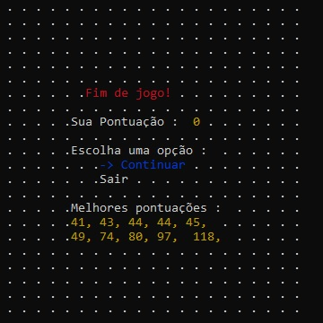
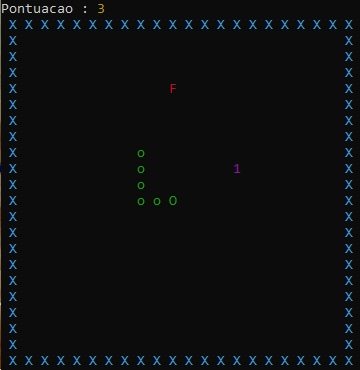

# Jogo-da-cobrinha #

## Jogo da cobrinha feito em C++, com interface exibida no terminal do windows, controles via teclado e salvamento de pontuações. ##

 
*Exibição colorida usando comandos do CMD Windows.* 

 
*Controles para menu : setas para alternar opções e enter para escolher.* 

* Encostar a cabeça da cobrinha (exibido como 'O') no próprio corpo (exibido como 'o') finaliza a partida, assim como encostar nas paredes (exibido como '#').
* Objeto frutas (exibido como 'F') te dá 1 ponto.
* Objeto bonus (exibido como um contador) possui tempo para ser pego até desaparecer e te dá 5 pontos.
