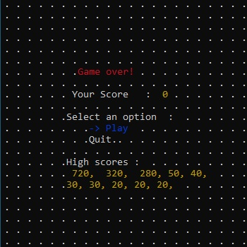
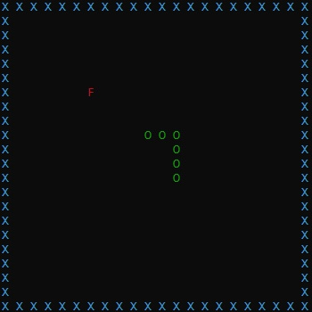

### Simple snake game for Windows terminal<hr>
## Instructions
### Just clone the repository and build the main.cpp file like below
```
git clone https://github.com/Andevson/snake-cpp.git
cd snake-cpp
g++ ./main.cpp -o main.exe
```
## Screenshots ##
<br>
<br>
